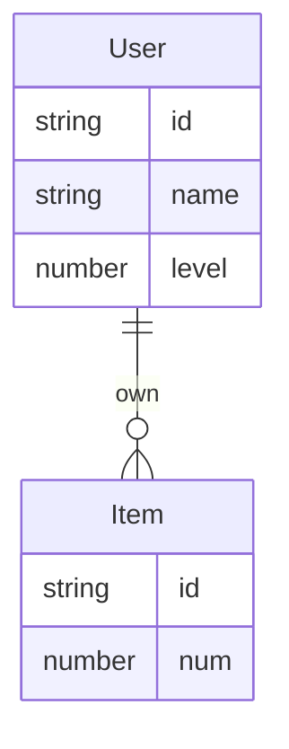

* Item refers to countable thing of player.

* The property num of Item is the quantity of Item.

* The id of Item come from following:
  1. Preset, constants in code or value in a config file.
      For example: money item should has a unique id created from code constant.  
  2. Runtime,
      For example: item that every instance own different property values with each other has
        unique id created when creating a instance of item. The quantity of this item is one in
        general.

